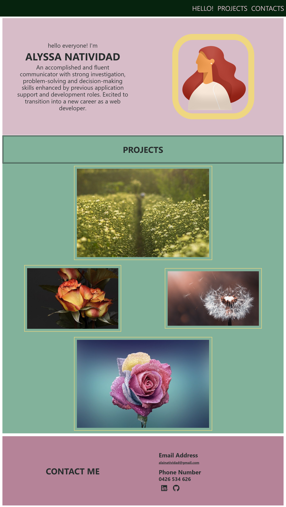

# Alyssa Natividad - Portfolio

## Description

A portfolio of work can showcase your skills and talents to employers looking to fill a part-time or full-time position. An effective portfolio highlights your strongest work as well as the thought processes behind it.

This portfolio contains three sections:

- About Me/Hello! section, that includes the developer's name, an avatar, and a small description about the developer
- Projects section, each image is a link to a previous work done by the developer. When hovering over the image, the title and description of the project is shown. And,
- Contact Me section that lists the ways the developer could be contacted along with their LinkedIn and Github accounts.

## Demo

Visit [this](https://alainatividad.github.io/Portfolio-Web-Alyssa-Natividad/) to see the webpage in action.

## Website

